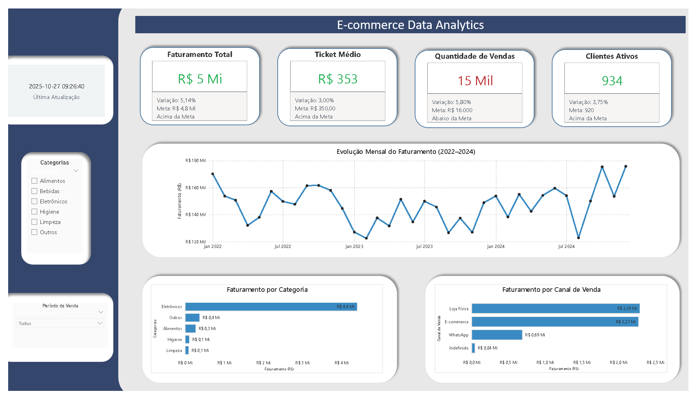
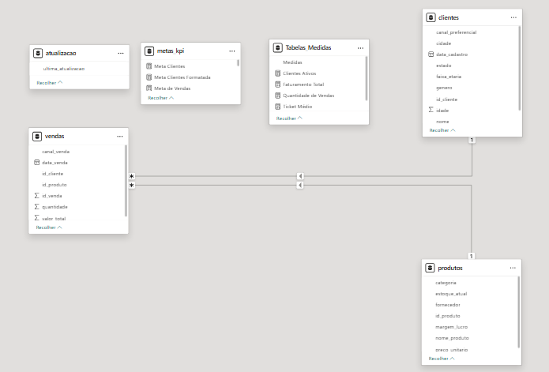

markdown
Copy
# E-commerce Data Analytics — Arquitetura e Pipeline de Dados

**Autor:** Gustavo de Paula Silva  
**Última atualização:** Outubro/2025

---

## 📋 Resumo Executivo

Este projeto implementa um **pipeline completo de dados** para um e-commerce fictício, simulando um ambiente real de BI/Análise de Dados. Ele integra **Python, SQLite e Power BI** para demonstrar como dados brutos se transformam em insights acionáveis. Ideal para quem deseja aprender ou implementar soluções de dados ponta a ponta, com foco em boas práticas, automação e reprodutibilidade.

---

## 📑 Sumário

- [Resumo Executivo](#-resumo-executivo)
- [Objetivo do Projeto](#1-objetivo-do-projeto)
- [Arquitetura do Pipeline](#2-arquitetura-do-pipeline-de-dados)
- [Modelo de Dados](#3-modelo-de-dados-data-warehouse)
- [Processos e Transformações](#4-processos-transformações-e-lógica-de-negócio)
- [Automação](#5-automação-e-camada-de-execução)
- [Visualização (Power BI)](#6-camada-de-visualização-power-bi)
- [Estrutura do Projeto](#7-estrutura-do-projeto)
- [Como Executar](#8-instruções-de-execução)
- [Tecnologias Utilizadas](#9-tecnologias-utilizadas)
- [Autor](#10-autor)
- [Melhorias Planejadas](#11-objetivos-de-melhoria-do-projeto-short-term)
- [Roadmap](#12-roadmap-evoluções-futuras)
- [Licença](#licença)

---

## 1. Objetivo do Projeto

O objetivo é desenvolver um **pipeline de dados funcional** que simula o fluxo real de trabalho em um ambiente de BI/Análise de Dados. O projeto cobre:

- **Geração de dados** sintéticos realistas
- **Armazenamento relacional** em banco de dados
- **Transformação e cálculo** de métricas de negócio
- **Automação de rotinas** para execução consistente
- **Visualização dinâmica** em Power BI

A solução foi estruturada com foco em **boas práticas de engenharia**, **reprodutibilidade** e **manutenibilidade**, servindo como referência para projetos reais.

---

## 2. Arquitetura do Pipeline de Dados

A solução foi organizada em um **pipeline modular**, refletindo etapas reais de engenharia/BI e priorizando clareza, reprodutibilidade e acoplamento mínimo entre componentes.
```
  ┌───────────────────────────────┐
  │  Geração de Dados             │
  │  (Python / Pandas)            │
  └───────────────┬───────────────┘
                  │
  ┌───────────────▼───────────────┐
  │  Armazenamento                │
  │  SQLite (Modelo Estrela)      │
  └───────────────┬───────────────┘
                  │
  ┌───────────────▼───────────────┐
  │  Transformações e Métricas     │
  │  (Pandas + SQL)                │
  └───────────────┬───────────────┘
                  │
  ┌───────────────▼───────────────┐
  │  Exportação / Automação        │
  │  Scripts Python (CSV / DB)     │
  └───────────────┬───────────────┘
                  │
  ┌───────────────▼───────────────┐
  │  Camada de Visualização        │
  │  Power BI                      │
  └───────────────────────────────┘
```
Cada componente funciona de forma **independente** e pode ser executado, validado ou evoluído isoladamente, garantindo manutenção simples e pipeline previsível.

---

## 3. Modelo de Dados (Data Warehouse)

A modelagem foi construída utilizando a abordagem **esquema estrela (star schema)**, amplamente adotada em ambientes de Business Intelligence por sua simplicidade, desempenho e aderência a consultas analíticas.

### Por que Esquema Estrela?

O esquema estrela facilita:

- Agregações rápidas e eficientes
- Uso de métricas e KPIs
- Criação de dashboards analíticos
- Manutenção e escalabilidade do modelo

No esquema estrela, o fluxo é dividido em:

- **Tabela Fato** → eventos transacionais (vendas)
- **Tabelas Dimensão** → atributos descritivos
- **Tabelas Auxiliares** → apoio analítico e operacional

---

### 3.1 Metodologia da Modelagem

A escolha pelo modelo estrela segue três princípios:

**1. Simplicidade Analítica**

O formato facilita perguntas de negócio comuns, como:
- "Qual categoria mais vende?"
- "Qual a evolução do faturamento mensal?"
- "Quem são os clientes mais ativos?"

**2. Performance em Ferramentas de BI**

Estruturas dimensionais reduzem a complexidade das junções e melhoram o desempenho no Power BI.

**3. Escalabilidade e Manutenção**

Novas dimensões ou métricas podem ser incluídas sem alterar os dados históricos.

---

### 3.2 Tabela Fato — `fato_vendas`

A tabela fato armazena os eventos do negócio com granularidade de **uma linha por venda**.

**Campos principais:**

- `id_venda` — identificador único da venda
- `id_produto` — referência ao produto
- `id_cliente` — referência ao cliente
- `data_venda` — data da transação
- `quantidade` — unidades vendidas
- `valor_total` — valor total da venda
- `canal_venda` — canal de distribuição

---

### 3.3 Tabelas Dimensão

#### `dim_produtos`
- `id_produto` — identificador único
- `nome_produto` — nome do produto
- `categoria` — categoria do produto
- `preco_unitario` — preço base

> Suporta análises por categoria, mix de produtos e precificação.

#### `dim_clientes`
- `id_cliente` — identificador único
- `nome` — nome do cliente
- `idade` — idade do cliente
- `genero` — gênero
- `localidade` — localização geográfica

> Suporta análises demográficas, segmentações e comportamento de compra.

---

### 3.4 Tabelas Auxiliares

#### `metas_kpi`
- `meta_faturamento` — meta de faturamento
- `meta_clientes` — meta de clientes
- `meta_vendas` — meta de vendas

> Utilizada para comparar desempenho real vs. metas.

#### `tabela_medidas`
- `clientes_ativos` — quantidade de clientes ativos
- `faturamento_total` — faturamento acumulado
- `vendas_totais` — total de vendas
- `ticket_medio` — valor médio por venda

> Centraliza cálculos reutilizáveis no Power BI.

#### `atualizacao`
- `ultima_atualizacao` — timestamp da última execução

> Permite ao dashboard exibir quando o pipeline foi executado pela última vez.

---

## 4. Processos, Transformações e Lógica de Negócio

A camada de transformação foi implementada utilizando **Pandas + SQL**, garantindo organização, rastreabilidade e separação clara entre etapas. O objetivo é preparar os dados para consumo analítico e geração de indicadores confiáveis.

### 4.1 Limpeza e Padronização

- Normalização de tipos (datas, inteiros, floats)
- Conversão de valores nulos
- Padronização de categorias e colunas
- Ajustes de granularidade para o modelo estrela

### 4.2 Integração das Tabelas

- Junção da fato com dimensões por chaves primárias
- Verificação de integridade referencial (clientes e produtos válidos)
- Criação das colunas derivadas necessárias para métricas

### 4.3 Cálculo das Métricas de Negócio

As principais métricas implementadas foram:

- **Faturamento Total** — soma de todas as vendas
- **Ticket Médio** — valor médio por transação
- **Vendas por Categoria** — desempenho por categoria de produto
- **Vendas por Canal** — desempenho por canal de distribuição
- **Clientes Ativos no Período** — quantidade de clientes que compraram
- **Evolução Mensal de Faturamento** — tendência temporal

Todas as métricas calculadas no notebook 2 e no script de automação foram exportadas para:

```
data/data_export/
```

### 4.4 Processos Automatizados

O script principal concentra as rotinas de transformação e exportação:

```
scripts/automacao_ecommerce.py
```

**Funções principais:**
- Geração automática dos relatórios CSV
- Atualização do banco SQLite
- Execução agendada do pipeline
- Geração da marca temporal de atualização

---

## 5. Automação e Camada de Execução

A etapa de automação foi construída para garantir **previsibilidade**, **reprodutibilidade** e **execução consistente** do pipeline, simulando rotinas reais de engenharia de dados.

### 5.1 Estrutura do Script

O pipeline automatizado está concentrado no arquivo:

```
scripts/automacao_ecommerce.py
```

**Principais responsabilidades:**
- Carregar o banco SQLite
- Executar transformações e cálculos
- Gerar e atualizar relatórios em CSV
- Registrar logs de execução
- Atualizar tabela de controle (`atualizacao`)
- Salvar métricas no modelo estrela

### 5.2 Registro de Logs

Para garantir rastreabilidade, o script utiliza logging estruturado:

[info] Iniciando pipeline…
[info] Carregando base SQLite…
[info] Executando transformações…
[info] Exportando métricas…
[success] Pipeline concluído com sucesso - timestamp registrado


### 5.3 Exportação de Artefatos

Ao final da execução, são gerados automaticamente:

- Arquivos CSV com métricas e indicadores
- Atualização da camada fato/dimensões
- Marca temporal em `atualizacao.ultima_atualizacao`

### 5.4 Reprodutibilidade

Todo o processo é:

- **Determinístico** — mesma entrada gera mesma saída
- **Idempotente** — repetir execução não quebra o pipeline
- **Documentado** — código comentado e explicado
- **Versionado** — rastreável via Git

Essas características são fundamentais em ambientes corporativos de engenharia de dados.

---

## 6. Camada de Visualização (Power BI)

A etapa final do pipeline consiste na exposição dos indicadores em um **dashboard interativo** desenvolvido no Power BI, conectado diretamente ao banco SQLite e aos arquivos CSV exportados pela automação.

### 6.1 Dashboard — E-commerce Data Analytics



O dashboard foi construído seguindo boas práticas de visualização e inclui:

**KPIs principais:**
- Faturamento Total
- Ticket Médio
- Quantidade de Vendas
- Clientes Ativos

**Gráficos e Tendências:**
- Evolução Mensal do Faturamento
- Faturamento por Categoria
- Ranking de Canais de Venda

**Filtros e Segmentações:**
- Período
- Categoria
- Canal
- Cliente

---

### 6.2 Atualização Automática

O dashboard lê:

- O banco de dados `ecommerce_realista.db`
- Os arquivos CSV em `data/data_export/`
- A tabela `atualizacao` para exibir o timestamp da última execução do pipeline

Essas integrações permitem acompanhamento dinâmico e sincronizado com o pipeline automatizado.

---

### 6.3 Modelo de Dados no Power BI

O modelo do Power BI foi construído utilizando um esquema **estrela**, garantindo alta performance e simplicidade nas consultas.



Ele é composto por:

- **Tabela Fato:** `fato_vendas`
- **Dimensões:** `dim_produtos`, `dim_clientes`
- **Tabelas Auxiliares:** `metas_kpi`, `tabela_medidas`, `atualizacao`

Essa modelagem fornece sustentação para KPIs, métricas derivadas e análises gerenciais.

---

### 6.4 Objetivo da Visualização

A camada de BI permite:

- Análises gerenciais em tempo real
- Identificação rápida de tendências
- Acompanhamento de metas
- Suporte à tomada de decisão baseada em dados

---

## 7. Estrutura do Projeto

A organização do repositório segue o padrão utilizado em pipelines de dados profissionais, garantindo separação clara entre camadas, reutilização e manutenibilidade.

```text
ecommerce-data-analytics_Gustavo_Paula_Silva/
│
├── dashboard/              # Relatório Power BI (.pbix)
├── data/                   # Banco SQLite e arquivos CSV exportados
│   ├── data_export/        # Métricas geradas pelo pipeline
│   └── ecommerce_realista.db
│
├── imagens/                # Prints e diagramas de apoio ao README
│
├── notebooks/              # Jupyter Notebooks (EDA e desenvolvimento)
│   ├── notebook_1_geracao_dados.ipynb
│   ├── notebook_2_transformacao.ipynb
│   └── notebook_3_analises.ipynb
│
├── scripts/                # Automação do pipeline
│   └── automacao_ecommerce.py
│
├── .gitignore
├── README.md
├── requirements.txt
└── LICENSE
```

### **Benefícios dessa estrutura:**

- Navegação simples e intuitiva
- Entendimento rápido por equipes de dados
- Modularidade nas camadas
- Possibilidade de escalabilidade e substituição de componentes

---

## 8. Instruções de Execução

A seguir estão os passos necessários para executar o pipeline completo, desde a instalação das dependências até a visualização dos resultados.

## 8.1 Clonar o Repositório

```bash
git clone https://github.com/gustavogit4/ecommerce-data-analytics.git
cd ecommerce-data-analytics
```

## 8.2 Instalar Dependências

```bash
pip install -r requirements.txt
```

## 8.3 Executar o Pipeline Automatizado

```bash
python scripts/automacao_ecommerce.py
```

**Após a execução:**

- CSVs atualizados estarão em data/data_export/
- O banco SQLite atualizado estará em data/ecommerce_realista.db

## 8.4 Abrir o Dashboard no Power BI

Abra o arquivo:

```bash
dashboard/ecommerce_dashboard.pbix
```

---

## 9. Tecnologias Utilizadas

A solução foi construída com um conjunto de ferramentas amplamente utilizadas em Engenharia de Dados e Análise de Dados:

**Python 3.11**

Utilizado para geração de dados sintéticos, transformações, criação do pipeline automatizado e exportação dos artefatos.

**Bibliotecas Principais**

- Pandas / NumPy — manipulação, limpeza e transformação de dados
- SQLite3 — armazenamento relacional e consultas SQL
- OS / Logging / Datetime — automação, registro de execução e controle temporal

**SQLite**

- Banco de dados relacional leve para simular um ambiente OLTP/operacional, posteriormente consumido pelo Power BI.


**Power BI**

- Construção do dashboard interativo com KPIs, filtros e modelo dimensional (estrela).

**Git & GitHub**

- Versionamento, documentação e publicação do projeto.

---

## 10. Autor

Gustavo de Paula Silva

Analista de Dados

Pós-graduação em Estatística para Ciência de Dados — PUC Minas

E-mail: gdepaulasilva966@gmail.com

GitHub: https://github.com/gustavogit4

LinkedIn: https://www.linkedin.com/in/gustavogit4/

---

## 11. Objetivos de Melhoria do Projeto (Short-Term)

Mesmo com o pipeline completamente funcional, existem melhorias de curto prazo planejadas para tornar a solução ainda mais robusta e organizada:

### 1. Padronização Completa do Código
- Revisão de nomes de variáveis e funções
- Organização do script de automação em funções menores
- Aplicação de estilo PEP8 para aumentar a legibilidade

### 2. Organização e Limpeza dos Notebooks
- Separar melhor as etapas (exploração, transformação, validação)
- Reduzir código redundante
- Adicionar explicações curtas antes de cada célula importante

### 3. Validação dos Dados Gerados
- Garantir consistência entre clientes, produtos e vendas
- Verificar integridade referencial antes de carregar no SQLite
- Criar checks básicos de qualidade (ex.: sem valores negativos)

### 4. Revisão do Modelo Estrela
- Padronizar nomes das tabelas e chaves
- Confirmar granularidade da fato
- Reorganizar dimensões para facilitar análises no Power BI

### 5. Refinamento do Dashboard
- Ajustar paleta de cores
- Padronizar títulos e textos
- Melhorar alinhamento visual para experiência mais profissional

Essas melhorias garantem qualidade técnica, manutenibilidade e reforçam boas práticas antes de evoluir para etapas mais avançadas.

---


### 12. Roadmap (Evoluções Futuras)

### 1. Melhorias na Automação
- Adicionar logs mais detalhados
- Criar funções separadas para cada etapa do pipeline
- Tratar possíveis erros na execução para evitar quebra do processo

### 2. Evolução do Banco de Dados
- Adicionar novas tabelas (ex.: categorias, regiões, métodos de pagamento)
- Criar simulações mais ricas e realistas para vendas
- Expandir o modelo estrela incluindo novas dimensões

### 3. Expansões no Dashboard
- Adicionar indicadores adicionais (ex.: margem fictícia, taxa de recompra)
- Criar novas páginas no relatório (ex.: visão do cliente, visão do produto)
- Refinar o design geral usando princípios de UX para BI

### 4. Pipeline Mais Flexível
- Permitir que o script seja executado com parâmetros (ex.: ano/mês)
- Criar opção de gerar dados somente para períodos novos

### 5. Publicação e Documentação
- Gerar documentação separada para o pipeline
- Criar um vídeo curto apresentando o funcionamento do projeto

---

## Licença
Este projeto está licenciado sob a licença MIT. Você é livre para usar, modificar e distribuir este código, desde que mantenha a atribuição ao autor original.

Para mais detalhes, consulte o arquivo LICENSE no repositório.

Desenvolvido por Gustavo de Paula Silva.


---