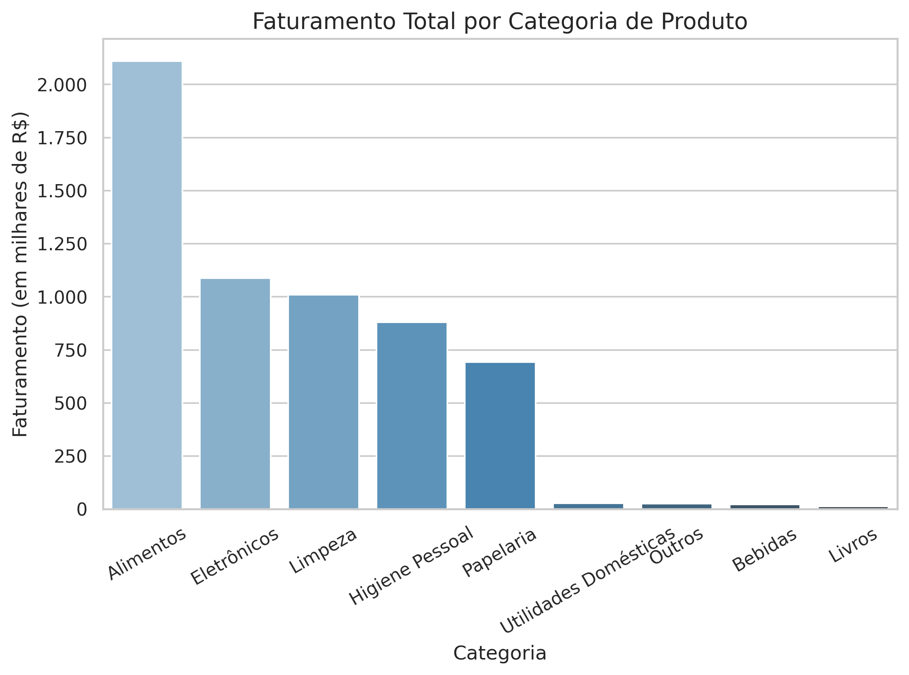
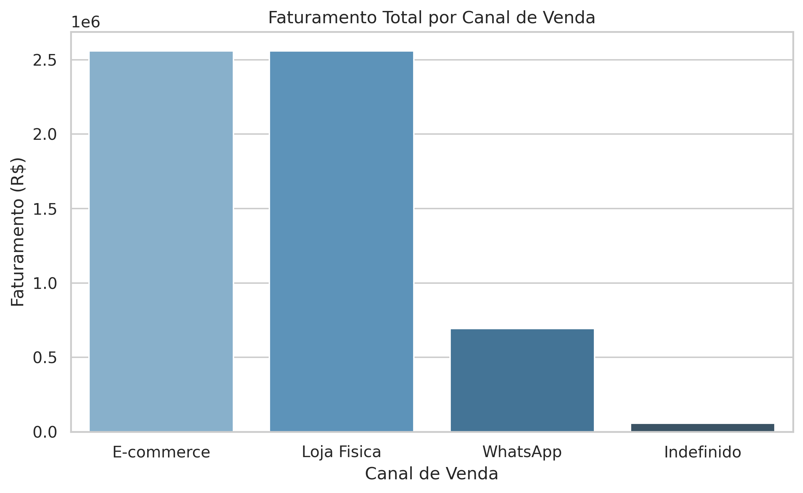
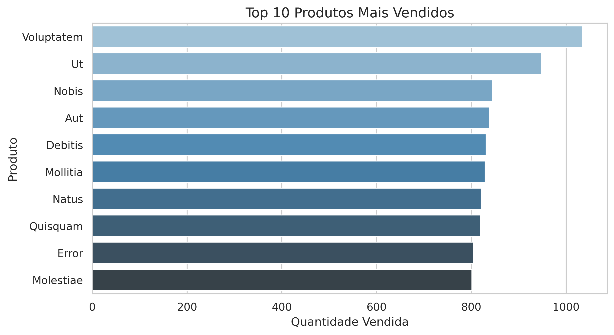
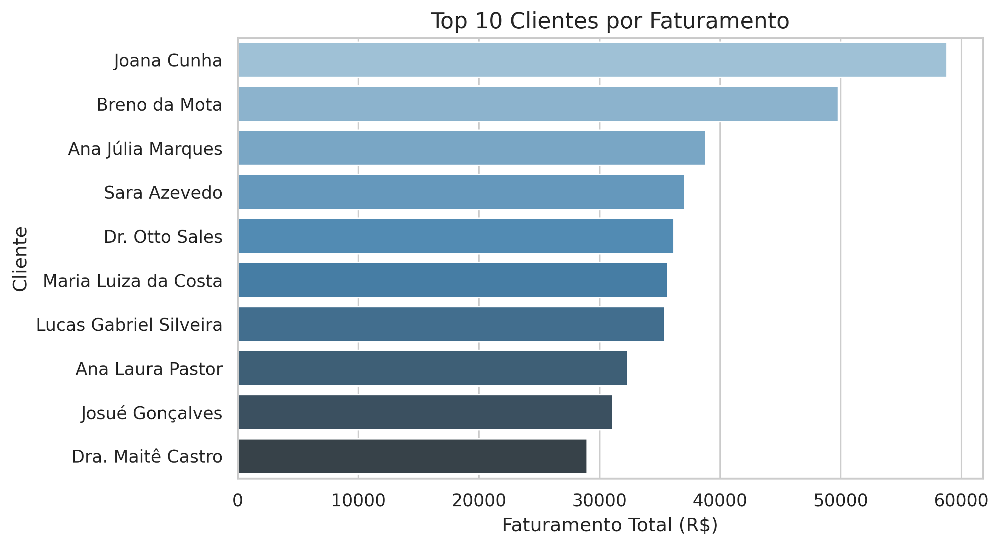
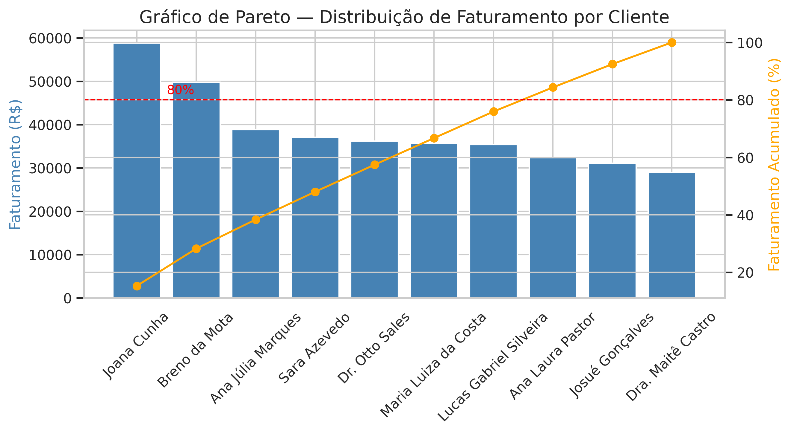

# 🛒 Análise e Automação de Vendas de um E-commerce Brasileiro

Este projeto simula um ambiente completo de análise e automação de dados para um e-commerce fictício, com foco em demonstrar habilidades práticas em **Python**, **SQL** e **Power BI** aplicadas à tomada de decisão.

---

## 🎯 Objetivo do Projeto

Construir um **pipeline de dados completo** — da geração e modelagem até a análise e automação de relatórios — representando o ciclo real de trabalho de um **Analista de Dados** em um ambiente corporativo.

---

## 🧠 Estrutura do Projeto

| Diretório / Arquivo | Descrição |
|----------------------|------------|
| 📁 **data/** | Contém o banco de dados relacional `ecommerce_realista.db` |
| 📁 **imagens/** | Gráficos gerados a partir das análises em Python |
| 📁 **notebooks/** | Códigos em Python (`.ipynb`) para geração, exploração e análise dos dados |
| 📄 **README.md** | Documentação completa do projeto |
| ⚙️ **requirements.txt** | Lista de dependências utilizadas |

---

## 🧩 Tecnologias Utilizadas

- **Python** → Pandas, NumPy, Faker, Matplotlib, Seaborn  
- **Banco de Dados** → SQLite  
- **Visualização e BI** → Power BI  
- **Controle de Versão** → Git & GitHub  

---

## 📊 Etapas do Projeto

O projeto segue uma arquitetura de **pipeline ELT (Extract, Load, Transform)**, desenvolvida em Python e integrada ao banco relacional SQLite.

As análises foram divididas em etapas modulares, representando o fluxo de trabalho de um analista de dados:

| Etapa | Descrição | Status |
|-------|------------|--------|
| 🧱 **01 - Geração e Carga de Dados (E + L)** | Geração de dados sintéticos com Faker e NumPy e carga automatizada no banco `ecommerce_realista.db`. | ✅ Concluído |
| 🧮 **02 - Transformação e Análise (T)** | Aplicação de transformações analíticas em SQL e Python para criação de métricas e visualizações estratégicas. | ✅ Concluído |
| ⚙️ **03 - Automação e Power BI** | Integração e criação de dashboard dinâmico com atualização automática. | 🔜 Próxima etapa |

---

## 📈 Etapa 2 — Transformação e Análise

Nesta fase, os dados foram tratados e analisados para compreender o comportamento de compra dos clientes, o desempenho das categorias e o equilíbrio entre os canais de venda.

As consultas SQL foram integradas ao Python para gerar **indicadores de faturamento, ticket médio e volume de vendas**, visualizados por meio de gráficos.

---

### 🔹 Principais Resultados

#### Faturamento por Categoria

#### Faturamento por Canal de Venda

#### Top 10 Produtos Mais Vendidos

#### Top 10 Clientes por Faturamento

#### Curva de Pareto — Distribuição de Faturamento por Cliente

---

## 💡 Conclusões e Insights Estratégicos

- **Faturamento total:** R$ 5,87 milhões, com 27 mil produtos vendidos e ticket médio de R$ 210,50.  
- **Canais equilibrados:** E-commerce e loja física dividiram o faturamento de forma quase igual (~R$ 2,56 milhões cada), demonstrando uma operação omnichannel consolidada.  
- **Categorias de destaque:** Alimentos e Eletrônicos concentram o maior faturamento, combinando produtos de alto giro e itens premium.  
- **Comportamento de clientes:** Um grupo reduzido de consumidores responde por grande parte da receita, confirmando o **efeito Pareto (80/20)**.  
- **Base de dados consistente:** Após limpeza e validações, não foram encontradas duplicatas e apenas nulos esperados em campos de canal de venda.  

🔎 **Síntese:**  
O e-commerce apresenta operação equilibrada, portfólio diversificado e base de clientes concentrada, mas fiel.  
As próximas etapas focarão na **automação e visualização dos KPIs no Power BI**, consolidando o ciclo completo de análise e tomada de decisão.

---

## 🗃️ Estrutura do Banco de Dados

**Arquivo:** `data/ecommerce_realista.db`

O banco foi construído em **SQLite**, com um **modelo estrela (Star Schema) simplificado**, amplamente utilizado em projetos de **Business Intelligence**.

Nesse modelo, as tabelas dimensão armazenam informações descritivas (como clientes e produtos), enquanto a tabela fato centraliza os eventos de negócio — neste caso, as vendas.

---

### 🔹 Modelo de Dados

#### **1. Dimensão: Clientes**
- `id_cliente` (PRIMARY KEY)  
- `nome`  
- `idade`  
- `genero`  
- `cidade`  
- `estado`  
- `data_cadastro`

#### **2. Dimensão: Produtos**
- `id_produto` (PRIMARY KEY)  
- `categoria`  
- `preco_unitario`  
- `descricao`

#### **3. Fato: Vendas**
- `id_venda` (PRIMARY KEY)  
- `id_cliente` (FOREIGN KEY → clientes)  
- `id_produto` (FOREIGN KEY → produtos)  
- `quantidade`  
- `data_venda`  
- `canal_venda`  
- `valor_total`

---

### 🔹 Relacionamentos

- **1:N** entre **Clientes → Vendas**  
- **1:N** entre **Produtos → Vendas**

Essas relações permitem análises de negócio como:
- Total de vendas por **canal**, **categoria** e **região**  
- Ticket médio e valor total gasto por **cliente**  
- Faturamento por **categoria de produto**  
- Tendências e sazonalidades de **vendas ao longo do tempo**

> O banco pode ser consultado via Python (`sqlite3`, `pandas.read_sql_query`) ou conectado diretamente ao **Power BI**, preservando todos os relacionamentos para criação de dashboards analíticos.

---

## 📈 Próximos Passos

A próxima fase do projeto consiste em criar dashboards interativos no **Power BI**, automatizando a atualização dos dados e monitorando métricas de desempenho em tempo real (KPIs de receita, clientes e categorias).

---

## 👤 Autor

**Gustavo de Paula Silva**  
📍 Analista de Dados  
📧 gdepaulasilva966@gmail.com  
🔗 [GitHub @gustavogit4](https://github.com/gustavogit4)  

> 💡 *Projeto desenvolvido com foco em aprendizado contínuo e aplicação prática de técnicas de Data Analytics e Business Intelligence em cenários de negócio reais.*
